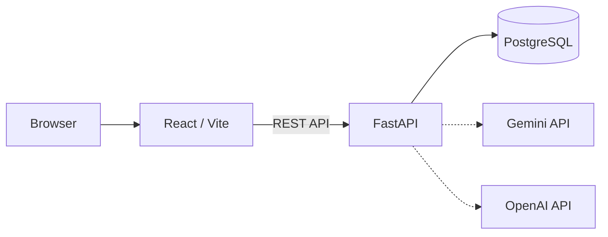

# Learning App

React / FastAPI / PostgreSQL で構成された、チーム向けのAIタスク管理アプリです。プロジェクトとタスクを整理し、優先度・期限・権限・監査ログを一つの画面で管理できます。抽象的なタスクは Gemini または OpenAI API を使って実行可能なサブタスクへ分解できます。

[](https://github.com/rtiak-ops/learning-app/actions/workflows/ci-backend.yml)
[](https://github.com/rtiak-ops/learning-app/actions/workflows/ci-frontend.yml)
[](LICENSE)

## 主な機能

- タスクの作成・編集・削除、期限・優先度・ステータス管理
- ドラッグ＆ドロップによるタスクの並び替え
- プロジェクト横断の検索とダッシュボード
- Gemini 優先、OpenAI フォールバックのAIタスク分解
- 組織単位のマルチテナント設計
- Admin / User のロールと、Project 単位の Viewer / Editor 権限
- 監査ログ、管理者向けヘルス・パフォーマンス情報
- JWT認証、レート制限、CORS、CIでのテスト・セキュリティスキャン

## 画面

<p align="center">
  
  
</p>

## 技術スタック

| 領域 | 採用技術 |
| --- | --- |
| Frontend | React 19, TypeScript, Vite, Tailwind CSS, TanStack Query |
| Backend | Python 3.13, FastAPI, SQLAlchemy 2 (Async), Pydantic v2 |
| Database | PostgreSQL 17, Alembic |
| AI | Google Gemini API / OpenAI API |
| Infrastructure | Docker Compose, AWS, Terraform |
| Quality | pytest, Vitest, React Testing Library, Ruff, GitHub Actions, Trivy |

## アーキテクチャ



本番構成では、フロントエンドを S3 / CloudFront、バックエンドを EC2 上のDocker、データベースを RDS PostgreSQL に配置する想定です。Terraformの詳細は [`terraform/`](terraform/) を参照してください。

## 必要条件

- Docker Desktop（Docker Compose v2）
- Git
- 個別起動する場合: Node.js、npm、Python 3.13
- AI分解を使う場合: `GOOGLE_API_KEY` または `OPENAI_API_KEY`

## クイックスタート（Docker）

```bash
git clone https://github.com/rtiak-ops/learning-app.git
cd learning-app
cp .env.example .env
```

`.env` を環境に合わせて編集します。最低限、データベースの3項目と `SECRET_KEY` を設定してください。AI機能を使わない場合、AI APIキーは空でも起動できます。

```bash
docker compose up --build
```

起動後は次のURLを開きます。

| URL | 用途 |
| --- | --- |
| [http://localhost](http://localhost) | Webアプリ |
| [http://localhost:8000/docs](http://localhost:8000/docs) | Swagger UI |
| [http://localhost:8000/redoc](http://localhost:8000/redoc) | ReDoc |

停止するには `Ctrl+C`、バックグラウンドのコンテナを停止するには次を実行します。

```bash
docker compose down
```

データベースのボリュームも削除する場合は、対象を確認したうえで `docker compose down -v` を実行してください。

## 個別起動（開発用）

### Backend

PostgreSQLを起動した状態で、別のターミナルから実行します。

```bash
cd backend
python -m venv .venv
# Windows PowerShell
.\.venv\Scripts\Activate.ps1
# macOS / Linux: source .venv/bin/activate
pip install -r requirements.txt
uvicorn app.main:app --reload
```

APIは `http://localhost:8000` で起動します。テストは次のコマンドです。

```bash
pytest
```

### Frontend

```bash
cd frontend
npm install
npm run dev
```

フロントエンドのAPI接続先は `.env` の `VITE_API_BASE_URL` で指定します。通常のローカル開発では `http://localhost:8000` を設定してください。

```bash
npm run build       # 本番ビルド
npm run lint        # ESLint
npm run test        # Vitest
npm run test:coverage
```

## 環境変数

設定項目の一覧と例は [`.env.example`](.env.example) にあります。秘密情報をコミットしないでください。

| 変数 | 用途 |
| --- | --- |
| `POSTGRES_USER`, `POSTGRES_PASSWORD`, `POSTGRES_DB` | PostgreSQLの接続情報 |
| `DATABASE_URL` | FastAPIからDBへ接続するURL |
| `SECRET_KEY` | JWT署名用の秘密鍵 |
| `GOOGLE_API_KEY` | Geminiによるタスク分解（任意） |
| `OPENAI_API_KEY` | OpenAIによるタスク分解（任意） |
| `CORS_ORIGINS` | 許可するフロントエンドのオリジン |
| `VITE_API_BASE_URL` | フロントエンドが接続するAPIのURL |

本番環境では、強度の高い秘密鍵・パスワードを使い、`DEBUG=false` としてください。

## ディレクトリ構成

```text
.
├── backend/          # FastAPI、SQLAlchemyモデル、Alembic、pytest
├── frontend/         # React / TypeScript / Vite
├── terraform/        # AWSインフラの定義
├── docs/              # スクリーンショット等
├── memo/              # 設計・コードリーディング資料
├── docker-compose.yml
└── .env.example
```

## データと権限

主要なデータは `organizations`、`users`、`projects`、`todos`、`project_collaborators`、`audit_logs` で構成されます。主要テーブルには `organization_id` を持たせ、APIでは認証ユーザーの組織を基準にデータを分離します。

- **Admin / User**: 組織レベルのロール
- **Viewer / Editor**: プロジェクト単位の操作権限
- **Todo status**: `TODO` / `IN_PROGRESS` / `REVIEW` / `DONE`
- **Todo priority**: `LOW` / `MEDIUM` / `HIGH` / `URGENT`

## AWSへのデプロイ

本番デプロイはTerraformとGitHub Actionsを利用します。AWSアカウント、認証情報、DNS・証明書などの環境依存設定が必要です。

```bash
cd terraform
terraform init
terraform plan
terraform apply
```

デプロイ前に、ワークフロー（[`.github/workflows/`](.github/workflows/)）が要求するGitHub Secretsを確認してください。特に `SECRET_KEY`、DBパスワード、AWS認証情報、AI APIキーはリポジトリへ直接記載しないでください。

## ドキュメント

- [認証フロー](memo/AUTH_FLOW.md)
- [コードリーディングガイド](memo/CODE_READING_GUIDE.md)
- [Backend README](backend/README.md)
- [Frontend README](frontend/README.md)
- [OpenAPI定義](openapi.json)

## ライセンス

[MIT License](LICENSE)
