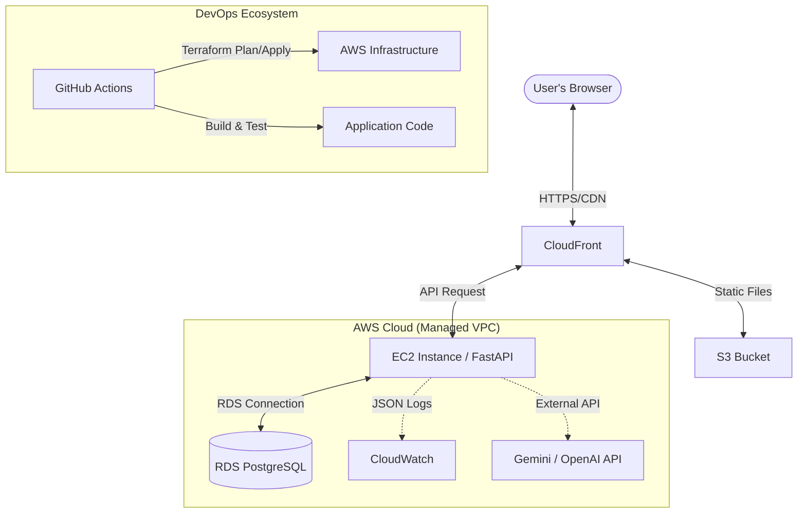
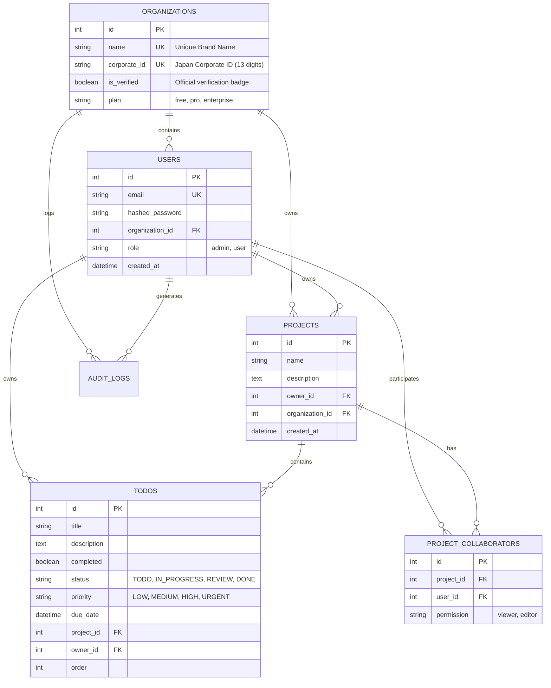

# 🚀 Learning App: Enterprise AI Task Management Platform

[](https://github.com/rtiak-ops/learning-app/actions/workflows/ci.yml)
[](https://github.com/rtiak-ops/learning-app/security/code-scanning)
[](https://opensource.org/licenses/MIT)
[](https://fastapi.tiangolo.com/)
[](https://reactjs.org/)
[](https://www.terraform.io/)

<table align="center">
  <tr>
    <td align="center" width="50%">
      <br>
      <sub>認証画面</sub>
    </td>
    <td align="center" width="50%">
      <br>
      <sub>ダッシュボード</sub>
    </td>
  </tr>
  <tr>
    <td align="center" width="50%">
      <br>
      <sub>監査ログ</sub>
    </td>
    <td align="center" width="50%">
      <br>
      <sub>パフォーマンス監視</sub>
    </td>
  </tr>
  <tr>
    <td align="center" width="50%">
      <br>
      <sub>ユーザー管理</sub>
    </td>
    <td align="center" width="50%">
      <br>
      <sub>プロジェクト管理</sub>
    </td>
  </tr>
</table>

## 🌟 プロジェクト概要

**Learning App** は、単なるタスク管理を超えた、**「実務の複雑さに耐えうるプロフェッショナルなタスクプラットフォーム」**です。
プロジェクト管理、ビジネスワークフロー、そして最新のLLM（大規模言語モデル）によるタスク分解機能を統合しました。

ビジネス現場で求められる「優先順位の可視化」「プロジェクト横断の進捗管理」「AIによる業務の細分化」を、グラスモーフィズムを採用したプレミアムなUXで実現しています。

## 📋 目次

- [✨ 主要なビジネス機能](#-主要なビジネス機能)
- [🏗️ システムアーキテクチャ](#️-システムアーキテクチャ)
- [📊 データベース設計 (ER図)](#-データベース設計-er図)
- [🎬 主要なシーケンス (Core Workflows)](#-主要なシーケンス-core-workflows)
- [💡 解決した技術的課題](#-解決した技術的課題)
- [🛠️ 技術スタック & 選定理由](#️-技術スタック--選定理由)
- [🏢 B2B マルチテナント設計の根幹](#-b2b-マルチテナント設計の根幹)
- [🧪 テスト & 品質管理](#-テスト--品質管理)
- [🚀 セットアップガイド](#-セットアップガイド)
  - [1. 🏠 ローカル開発環境 (Docker)](#1--ローカル開発環境-docker)
  - [2. ☁️ クラウド展開 (AWS/Terraform)](#2--クラウド展開-awsterraform)
- [📈 今後の展望 (Product Roadmap)](#-今後の展望-product-roadmap)

---

## ✨ 主要なビジネス機能

### 1. 📊 ダッシュボード

全体のタスク進捗、プロジェクトごとの達成率、緊急タスクの警告を一目で把握可能。

- **達成率の可視化**: プロジェクトごとの進捗を動的なプログレスバーで表示。
- **緊急アラート**: 優先度が「至急(URGENT)」のタスクが残っている場合に自動で通知。

### 2. 📁 プロジェクト・階層管理

タスクをプロジェクト単位で整理し、業務の境界を明確にします。

- **プロジェクト横断表示**: すべてのタスクを俯瞰するビューと、プロジェクトに特化したビューを即座に切り替え。
- **動的なフォルダ機能**: サイドバーから直感的にプロジェクトを作成・管理。

### 3. 🚦 ビジネス・ワークフロー

現場の運用に即したタスク情報の管理を実現。

- **4段階の優先度**: `LOW`, `MEDIUM`, `HIGH`, `URGENT` によるフィルタリング。
- **ライフサイクル管理**: `未着手` → `進行中` → `レビュー` → `完了` のステータス遷移。
- **期限管理**: 期限付きタスクを視覚的に強調。

### 4. 🧠 AIタスク分解 (GenAI Integration)

「大きな課題」を「実行可能なステップ」に。

- **AI分解**: 入力された抽象的なタスクを、Google Gemini API を優先して活用し、利用可能な場合は OpenAI へフォールバックして具体化・細分化。
- **シームレスな登録**: 分解されたサブタスクを、現在のプロジェクト配下に一括で自動登録。

### 5. 🔍 高速な全文検索

必要な情報を瞬時に特定。

- **リアルタイム検索**: タイトルや説明文から、プロジェクト横断でタスクを高速に検索。
- **動的フィルタリング**: 検索結果をさらに優先度やステータスで絞り込み可能。

### 6. 👥 チーム・組織管理 (Governance & Collaboration)

プロジェクト共有から組織レベルのガバナンスまで対応。

- **組織メンバー招待**: 管理者は既存ユーザーをメールアドレスで検索し、自組織へ招待・追加が可能。
- **プロジェクト共有**: 特定のプロジェクトに対して、他ユーザーを招待し、階層的なタスク管理を共同で実施。
- **詳細な権限管理 (RBAC)**:
  - **Roles**: システム管理者(Admin) と 一般ユーザー(User) を定義。
  - **Permissions**: プロジェクト単位で 編集権限(Editor) または 閲覧のみ(Viewer) を付与可能。
- **管理者保護**: 組織内に管理者が不在になるのを防ぐため、最後の管理者の権限降格を制限するバリデーションを実装。

### 🛡️ 高度なエンジニアリング機能 (Advanced Engineering)

- **🧩 Role-Based Access Control (RBAC)**: システム全体の管理者（Admin）と一般ユーザー（User）を分離。Admin専用の分析・監視ダッシュボードを搭載。
- **📜 監査ログ (Audit Log)**: データの作成・更新・削除の全履歴を「誰が・いつ・何をしたか」という形で記録し、可視化。
- **📈 パフォーマンス監視 (Observability)**:
  - **Slow Query Detection**: SQLAlchemyのイベントリスナーによる100ms超のクエリ自動検知。
  - **Health Dashboard**: DBレイテンシやシステム統計（ユーザー数、タスク数等）のリアルタイム表示。
- **💰 自動コスト最適化 (Cost Optimization)**:
  - **Smart Scheduler**: AWS EventBridge と Lambda を連携させ、業務時間外（夜間）の EC2/RDS 自動停止と、始業前の自動起動プロセスを構築。運用コストを最小化。

---

## 🏗️ システムアーキテクチャ

可用性とスケーラビリティを考慮し、AWSのマネージドサービスをフル活用したアーキテクチャを採用しています。



### システム構成のポイント

- **フロントエンド層**: React + TypeScript で構築された SPA。Vite で最適化され、S3 + CloudFront を通じて世界中に低レイテンシで配信されます。
- **API層**: 高速な Python フレームワーク FastAPI を採用。EC2 上で Docker コンテナとして動作し、Nginx がリバースプロキシとしてリクエストを中継します。
- **データ層**: マネージドデータベースの Amazon RDS (PostgreSQL) を利用。プライベートサブネットに配置することでセキュリティを担保しています。
- **AI 連携**: Google Gemini API を優先し、設定がない場合は OpenAI API でも自然言語によるタスクの自動分解機能を提供しています。

---

## 📊 データベース設計 (ER図)

ビジネス要件に対応した、リレーショナルなデータ構造を採用しています。



### 主要テーブルの説明

- **users**: システムの利用者情報を格納。`hashed_password` による安全な管理に加え、`role` による権限管理（管理者/一般）をサポートします。
- **projects**: 関連するタスクをグループ化するコンテナ。
- **project_collaborators**: プロジェクトの共有情報を管理。特定のプロジェクトに対して複数のユーザーを招待し、権限を割り当てます。
- **todos**: 最小単位のタスク。`status`, `priority`, `due_date` を保持し、詳細な管理が可能です。

---

## 🔥 独自のエンジニアリング・ポイント

### 1. ⚡ 楽観的UI更新 (Optimistic UI)

**TanStack Query** を活用し、並び替えやステータス更新を「待ち時間ゼロ」で反映。APIのレスポンスを待たずにUIを先行更新することで、デスクトップアプリのような操作感を提供。

### 2. 🛡️ セキュリティ・バイ・デザイン

- **認証**: JWT + HttpOnly Cookie (推奨) / Authorization Header によるセキュアな認証。
- **スキャン**: **Trivy** によるコンテナ/依存関係の脆弱性スキャンをGitHub Actionsで常時実施。
- **インフラ**: TerraformによるVPC/セキュリティグループの厳密な定義。

### 3. 🎨 プレミアムUX

- **グラスモーフィズム**: 半透明のぼかし効果を多用した最新のUIデザイン。
- **ダークモード同期**: OSの設定やユーザーの好みに合わせたスムーズなテーマ切り替え。

---

## 🛠️ 技術スタック & 選定理由

| カテゴリ     | 技術                          | 選定理由・トレードオフ                                                                                                                                |
| ------------ | ----------------------------- | ----------------------------------------------------------------------------------------------------------------------------------------------------- |
| **Frontend** | React 19, TypeScript          | 最新のAPI活用と型安全性の両立。Next.jsではなくSPA（Vite）を選んだのは、低コストなS3配信と、純粋なクライアントサイドのステート管理能力を誇示するため。 |
| **Backend**  | Python 3.13, FastAPI          | 非同期処理（AsyncIO）による高パフォーマンスなI/O。型ヒントによる堅牢な開発とAPIドキュメント自動生成によるDX向上。                                     |
| **Logic**    | TanStack Query                | 楽観的UI更新（Optimistic Update）の実装による圧倒的なUX。自前でのキャッシュ管理を避け、ライブラリに任せることでコードの抽象化を促進。                 |
| **Database** | PostgreSQL 17                 | 複雑なリレーション、JSON型による将来的なAIスレッドの保存を視野に入れ、堅牢なRDBMSを選択。                                                             |
| **Infra**    | AWS, Terraform                | インフラのコード化（IaC）。手動設定を排除し、再現性とスケーラビリティを担保。                                                                         |
| **AI**       | Gemini / OpenAI               | Gemini を優先し、利用できない場合は OpenAI へフォールバックする構成。コストと応答速度のバランスを取ってタスク分解を実行。                             |
| **Tools**    | Trivy, GitHub Actions, Docker | 自動脆弱性スキャン、完全自動化されたCI/CD、コンテナ化による一貫した実行環境の提供。                                                                   |

---

## 🏢 B2B マルチテナント設計の根幹

SaaSプロダクトの核心である「データ隔離」と「信頼性」について、本プロジェクトでは以下の設計思想を採用しています。

### 1. 論理分離 (Logical Isolation) によるマルチテナント

ポートフォリオとして、運用コスト（RDSコスト）とスケーラビリティのバランスを考慮し、**「共有スキーマ・行レベル分離」**方式を採用しています。

- **実装**: 全ての主要テーブル（`Projects`, `AuditLogs`等）に `organization_id` を付与。
- **セキュリティ**: APIクエリ時、認証された `current_user` の `organization_id` を強制的に WHERE 句へバインド。これにより、他組織のデータへのアクセスを物理的・構造的に遮断しています。

### 2. 「なりすまし」と「ブランド占有」への対策

B2B SaaSにおいて「勝手に他社を名乗る」プロトコル上のリスクに対し、以下のガードレールを実装・設計しています。

- **名称/法人番号のユニーク制約**: データベースレベルで同一社名・同一法人番号の重複登録を排除。早い者勝ちによるブランド占有を技術的に防止。
- **法人確認プロセス (Mock Verification)**: 入力された法人番号が13桁の有効な形式である場合に限り、UI上に「✓ 認証済」バッジを表示。
- **今後の展望（フェーズ2）**: 実運用に向けては、**「メールドメイン認証」**（例：sony.comのメアドを持つ者のみがその組織を扱える）の導入を設計済みです。あえて現状を自由登録にしているのは、レビュアーが即座に複数組織の切り替え挙動を確認できるようにするためという意図があります。

## 🧪 テスト & 品質管理

「動作すること」だけでなく「壊れないこと」を重視したテスト戦略を採用しています。

- **Backend**: `pytest` による単体・統合テスト。
  - **マルチテナント隔離テスト**: 組織Aのユーザーが組織Bのデータにアクセスできないことを保証する厳格な隔離テスト（`test_multi_tenancy_isolation`）を実装。
  - **異常系テスト**: 権限のないアクセス、レートリミット超過、DB接続断などを重点的にカバー。
- **Frontend**: `Vitest` + `React Testing Library` によるコンポーネントテスト。ローディング状態、エラー表示、フォームバリデーションを検証。
- **CI/CD**:
  - **カバレッジ目標**: 80%以上を維持。Codecovによる可視化。
  - **セキュリティ**: `Trivy` スキャンを全プルリクエストで実行し、高リスクな脆弱性を抱えたままのデプロイを阻止。
  - **自動化**: インフラからアプリまで、`main`へのマージのみで全て構築される完全なパイプライン。

---

## 🚀 セットアップガイド

### 1. 🏠 ローカル開発環境 (Docker)

最も手軽に環境を構築できる方法です。

```bash
git clone https://github.com/rtiak-ops/learning-app.git
cd learning-app
cp .env.example .env
# .envにGOOGLE_API_KEYなどを設定（任意）
docker compose up --build
```

- **App**: [http://localhost](http://localhost)
- **API Docs**: [http://localhost:8000/docs](http://localhost:8000/docs)

### 2. ☁️ クラウド展開 (AWS/Terraform)

AWS上に本番環境を自動構築し、GitHub Actionsによる継続的デプロイ（CD）を有効化します。

#### ① AWS 認証の設定

AWS SSOを使用して、ローカル端末からAWSを操作可能にします。

```bash
aws sso login
```

#### ② インフラの構築 (Terraform)

`terraform` ディレクトリに移動し、インフラを作成します。

```bash
cd terraform
# 初期化
terraform init
# 構築の実行 (変数の入力が求められます)
terraform apply
```

#### ③ GitHub Secrets の設定

GitHubのリポジトリ設定（Settings > Secrets and variables > Actions）に以下の値を登録することで、自動デプロイが開始されます。

| Secret Key       | 説明                                                  |
| ---------------- | ----------------------------------------------------- |
| `AWS_ROLE_ARN`   | Terraform実行後に出力された `github_actions_role_arn` |
| `APP_SECRET_KEY` | JWT認証用の秘密鍵（32文字以上のランダムな文字列）     |
| `DB_PASSWORD`    | RDSのマスターパスワード                               |
| `EC2_SSH_KEY`    | EC2接続用の秘密鍵 (PEM形式)                           |
| `EC2_USER`       | `ec2-user` か `ubuntu` (AMIに依存)                    |
| `EC2_HOST`       | EC2のパブリックIP（動的取得に失敗する場合の予備）     |
| `GOOGLE_API_KEY` | Gemini APIキー                                        |

#### ④ デプロイ

`main` または `develop` ブランチにコードを `push` すると、自動的にフロントエンド（S3/CloudFront）とバックエンド（EC2/Docker）が更新されます。

---

## 📈 今後の展望 (Product Roadmap)

本プロジェクトは、個人タスク管理から「エンタープライズ向けSaaS」への進化を続けています。

### ✅ 実装済み (B2B Foundation)

- [x] **マルチテナント (Multi-tenancy) 対応**: 組織（Organization）単位での完全なデータ隔離を実装。
- [x] **エンタープライズ・メンタリティ**: 監査ログ (Audit Log) やロールベースの権限管理 (RBAC) の基盤構築。

### 🚀 ロードマップ

1.  **高度なセキュリティ (Secure Enterprise)**:
    - **SSO連携**: Google Workspace / Azure AD (Microsoft Entra ID) とのSAML/OIDC連携。
    - **2FA/MFA**: 二要素認証によるアカウントセキュリティの強化。
2.  **外部連携 & オートメーション (Integrations)**:
    - **Slack / Teams 連携**: タスク状況のリアルタイム通知。
    - **Public API & Webhook**: 外部システムからの操作・データ連携の解放。
3.  **収益化基盤 (Monetization)**:
    - **決済連携 (Stripe)**: 組織単位のサブスクリプション決済管理。
    - **プラン制限機能**: プランに応じた機能・リソース制限の動的制御。
4.  **AI分析 (AI-Driven Insights)**:
    - AIによる業務ベロシティの分析と、組織全体の業務改善提案レポートの自動生成。

---

## 📖 詳細ドキュメント

- [🔐 認証フローの徹底解説](memo/AUTH_FLOW.md)
- [📘 コードリーディング・ガイド](memo/CODE_READING_GUIDE.md)

---

**Developed by [rtiak-ops]**  
_Enterprise Scale. AI Native. Professional Quality._
